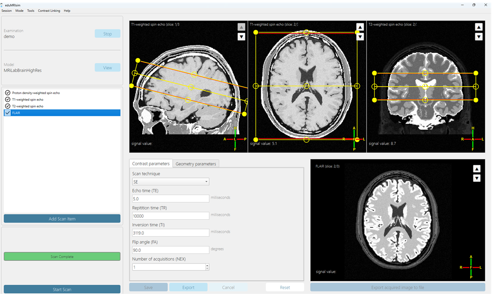

# **About eduMRIsim**

The aim of the eduMRIsim project is to revolutionize MRI education by providing **a hands-on, simulation-based learning tool** that enables students to apply MRI principles in a controlled, virtual environment. This initiative seeks to fill the gap in traditional MRI education, which is largely theoretical due to the prohibitive costs and complexities of real MRI machines. By creating **a clinically realistic, user-friendly simulator**, eduMRIsim will allow students to engage in the entire MRI workflow, from scan planning to image analysis.

